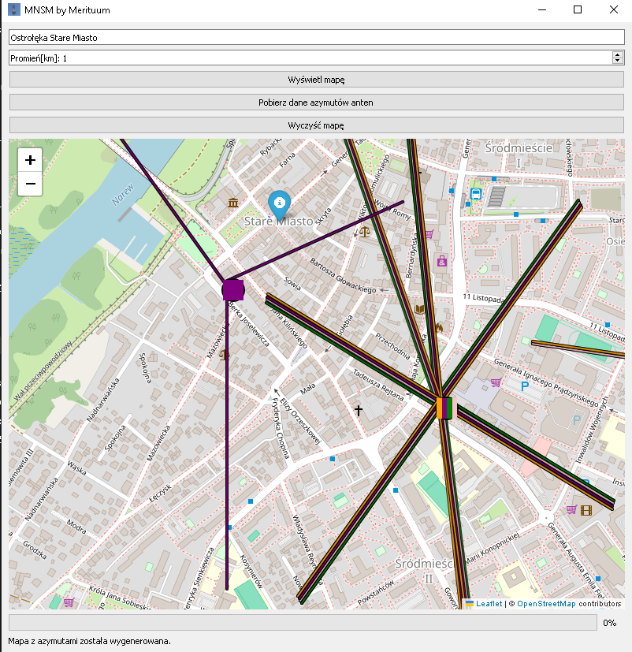

## Mapa nadajników sieci mobilnej (MNSM) 
Po prowadzeniu danych przez użytkownika program przeszukuje bazę danych nadajników udostępnianą przez BTSearch i wyświetla nadajniki polskich operatorów w promieniu wybranym przez użytkownika - przedział pomiędzy od podanego odresu. Rozwiązanie te może pomóc w ocenie infrastruktury obecnej w wybranej lokalizacji. 
Program wyświetla także azymuty anten nadajników sieci mobilnej, co jest unikatowe w tego typu mapach.

# Instrukacja obsługi
Wymagania środowiskowe:
- Python 3.1X

Aby program działał poprawnie należy umieścić w jednym folderze pliki:
- "main.exe.", 
- "output.csv", 
- "ikona.ico", 
- "requirements.txt"

Działanie programu:
- Użytkownik wpisuje lokalizację i wyznacza promień w kilometrach od miejsca, które podał,
- Po naciśnięciu "Wyświetl mapę", pojawia się mapa z nadajnikami,
- Po naciśnięciu "Pobierz dane azymutów anten" następuje rozpoczęcie pobierania danych nadajników. W zależności od ilości nadajników i prędkości internetu czas pobierania wynosi od 15 sekund do nawet 20minut!,
- Aby wyświetlić azymuty należy nacisnąć "Wyczyść mapę" i nacisnąć "Wyświetl mapę" ponownie. Po tych krokach uzyskany zostaje efekt jak na zrzucie ekranu poniżej. 

# Zrzuty ekranu z działania aplikacji
 Zrzut ekranu z aplikacji wyświetlający nadajniki oraz azymuty anten nadajników sieci mobilnych

# Aktualne prace
Po pomyślnym zrealizowaniu wyświetlania azymutów na mapie rozwiązywane są problemy dotyczące błędów pobierania danych z si2pem w przypadku niektórych nadajników. 